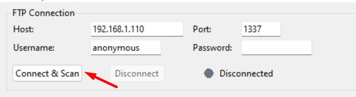
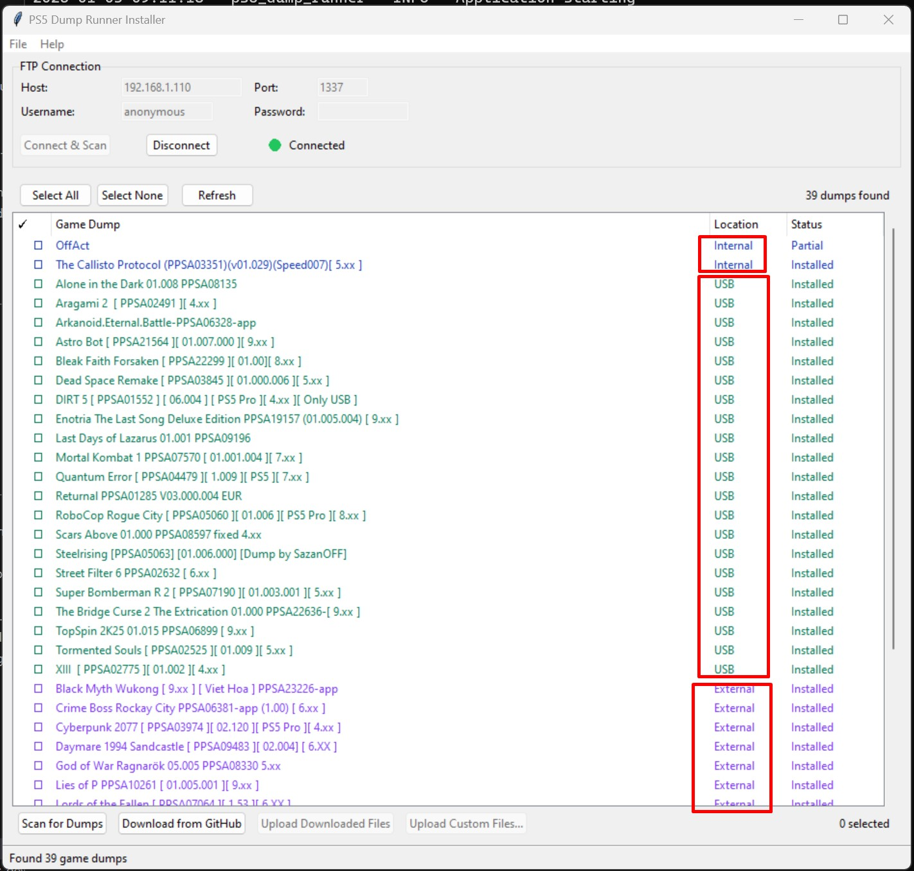
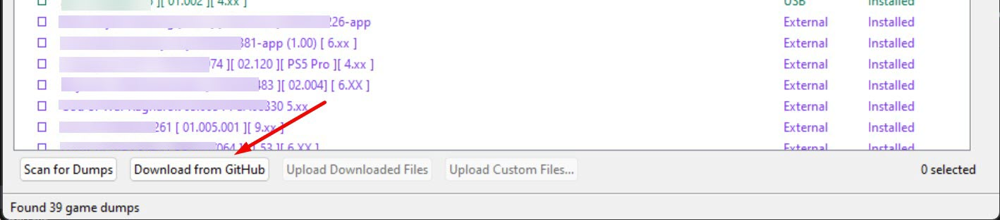
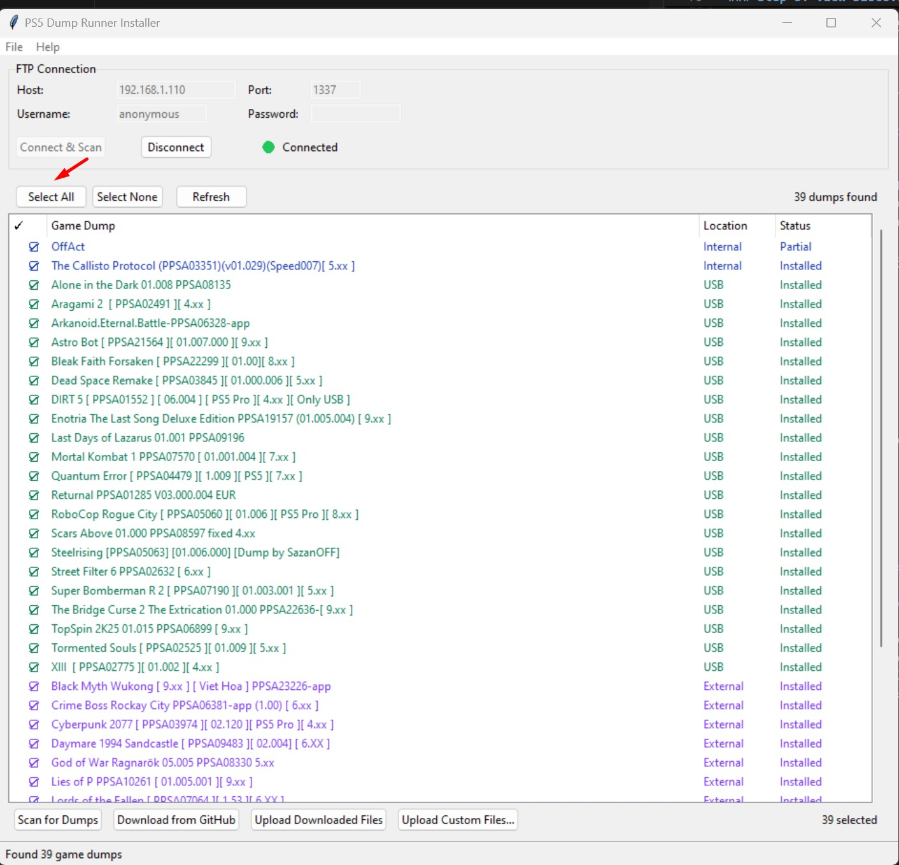
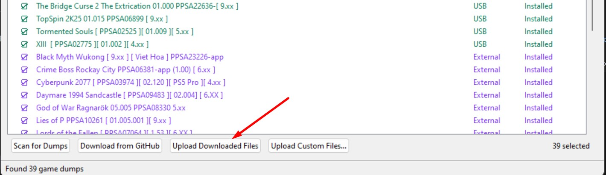
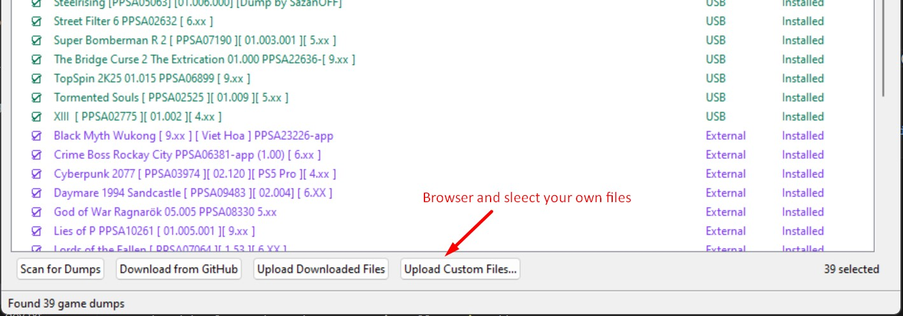
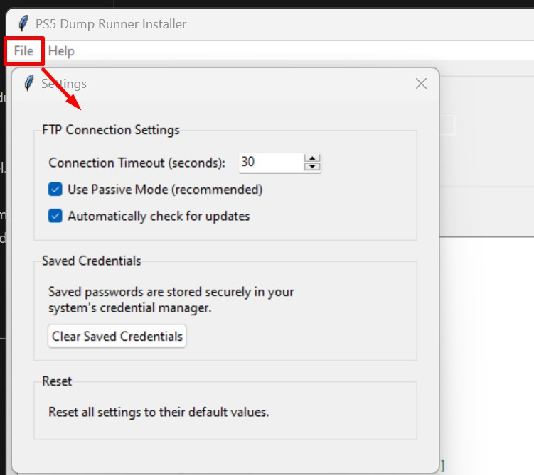

# PS5 Dump Runner Installer

> **Tired of manually uploading every update of `dump_runner.elf` and `homebrew.js` from EchoStretch to each of your game dumps located in internal, external M.2, and USB storages?**
>
> This tool automates everything for you! With just a few clicks, you can download the latest releases and deploy them to all your game dumps at once.

## Why Use This Tool?

- **Save Time** - No more navigating through FTP folders manually for each game
- **Stay Updated** - Download the latest releases directly from [EchoStretch GitHub](https://github.com/EchoStretch/ps5-payload-dev/releases) with one click
- **Batch Operations** - Upload to 10, 20, or even 50 game dumps simultaneously
- **Never Miss a Game** - Auto-scan finds all your dumps located in internal storage, external M.2, and USB drives
- **Track Progress** - Visual progress bars show exactly what's happening
- **Safe & Reliable** - Confirmation prompts before overwriting, detailed error reporting
- **Custom Files** - Option to upload your own experimental dump_runner files
- **Remember Settings** - Your connection settings and credentials are saved securely between sessions

---

## Requirements

- Python 3.11 or higher
- PS5 with FTP server running (e.g., via homebrew)
- Network connection between PC and PS5

## Installation

### From Source

```bash
# Clone the repository
git clone https://github.com/yourusername/ps5-dump-runner-installer.git
cd ps5-dump-runner-installer

# Install dependencies
pip install -r requirements.txt

# Run the application
python -m src.main
```

### From Executable

Download the latest release from the Releases page and run `PS5DumpRunnerInstaller.exe`.

---

## Usage Guide

### Step 1: Start FTP Server on PS5

Before using this tool, you need to have an FTP server running on your PS5.

---

### Step 2: Connect to Your PS5

1. Enter your PS5's IP address in the **Host** field
2. Default port is `1337` (adjust if your FTP server uses a different port)
3. Default username is `anonymous` (adjust if needed)
4. Enter password if required
5. Click **Connect & Scan**



---

### Step 3: View Discovered Game Dumps

After connecting, the application will automatically scan and display all game dumps found on your PS5.

- Each dump shows its **Title ID** (e.g., CUSA12345)
- Location indicator shows where the dump is stored (Internal, USB, Extended)
- Status shows: "Installed", "Partial", or "Not Installed"



---

### Step 4: Download Latest dump_runner from GitHub

Click **Download from GitHub** to fetch the latest official release from EchoStretch's repository.

- A dialog shows available releases with version info
- Select the version you want to download
- Progress bar shows download status



---

### Step 5: Select Game Dumps to Update

Select which game dumps you want to install dump_runner files to:

- Click checkboxes next to individual dumps
- Use **Select All** to select everything
- Use **Select None** to clear selection
- The selection counter shows how many dumps are selected



---

### Step 6: Upload Files to Selected Dumps

Click **Upload Downloaded Files** to begin uploading to all selected game dumps.

- Progress bar shows overall upload progress
- Each dump is updated one by one
- Status updates in real-time
- After upload completes, dumps are automatically rescanned to show updated status



---

### Step 7: Upload Custom/Experimental Files (Optional)

If you have custom or experimental dump_runner files, click **Upload Custom Files...** to browse and upload your own files.

- Select your custom `dump_runner.elf` and/or `homebrew.js` files
- A warning reminds you these are not official releases
- Files are uploaded to all selected game dumps



---

### Step 8: Manage Settings

Access **File > Settings** to configure:

- FTP connection timeout
- Passive mode toggle
- Auto-update check setting
- Clear saved credentials



---

## Scan Locations

The application scans these PS5 FTP paths for game dumps:

| Location | Path |
|----------|------|
| Internal Storage | `/data/homebrew/` |
| USB Devices | `/mnt/usb0/homebrew/` through `/mnt/usb7/homebrew/` |
| Extended Storage | `/mnt/ext0/homebrew/` through `/mnt/ext7/homebrew/` |

## Files Installed

For each game dump, the following files are uploaded:
- `dump_runner.elf` - The main executable
- `homebrew.js` - JavaScript configuration file

## File Cache Location

Downloaded files are cached locally at:
- **Windows**: `%APPDATA%\PS5DumpRunnerInstaller\cache\releases\`
- **Linux**: `~/.config/PS5DumpRunnerInstaller/cache/releases/`
- **macOS**: `~/Library/Application Support/PS5DumpRunnerInstaller/cache/releases/`

---

## Troubleshooting

### Cannot connect to PS5
- Verify the FTP server is running on your PS5
- Check the IP address is correct
- Ensure your PC and PS5 are on the same network
- Try disabling firewall temporarily

### No dumps found
- Ensure game dumps are in the correct homebrew directories
- Check that the FTP server has access to the storage locations

### Upload fails
- Verify FTP connection is still active
- Check available space on the target storage
- Ensure you have write permissions

---

## Development

### Running Tests

```bash
# Run all tests
pytest

# Run with coverage
pytest --cov=src --cov-report=html
```

### Building Executable

```bash
# Using the spec file (recommended)
pyinstaller build/ps5-dump-runner-installer.spec

# Or manually
pyinstaller --onefile --windowed --name "PS5DumpRunnerInstaller" --icon resources/icons/app_icon.ico src/main.py
```

The built executable will be in `build/dist/PS5DumpRunnerInstaller.exe`.

---

## Credits

- [EchoStretch](https://github.com/EchoStretch) - dump_runner development
- This installer tool provides a convenient way to deploy dump_runner files

## License

MIT License - See LICENSE file for details.

## Disclaimer

This tool is provided for educational and legitimate homebrew purposes only. Users are responsible for ensuring they comply with all applicable laws and terms of service.
